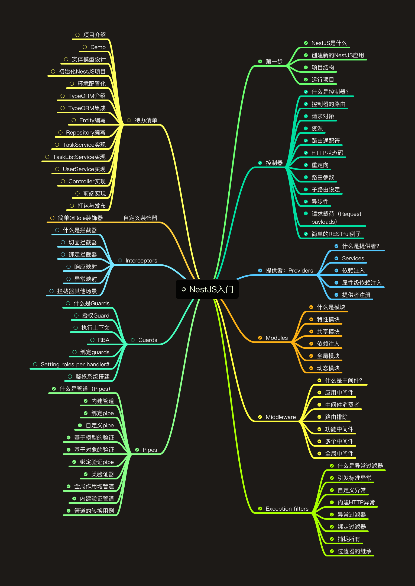

  

# NestJS后端开发入门

程序猿依力NestJS后端开发入门教程官方代码仓库

## 前言

本项目为程序猿依力NestJS后端开发入门教程的代码仓库，同套课程视频课程请参考：[NestJS后端开发入门](https://edu.bili-tech.com/course/58)

## 课程答疑请添加微信二维码（备注课程购买渠道：B站或网校）

## 课程规划及进度

## commit说明

课时与commit前缀一一对应，如：课时49的commit为 "lesson49: 全局作用域的管道"

